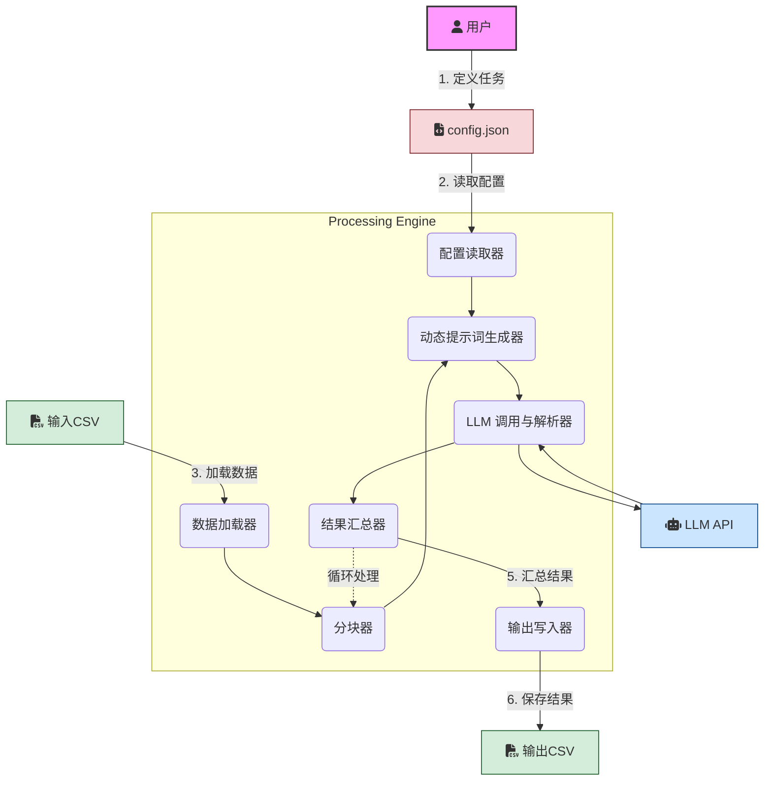

## **通用CSV大模型处理引擎：开发指导文档**

**版本:** 1.1
**日期:** 2025-08-09

---

### **1. 项目概述 (Project Overview)**

#### **1.1 项目目标**

本项目旨在开发一个**通用型后端处理引擎**，能够利用上下文长度有限（如4K、8K tokens）的**大语言模型（LLM）**，对**大型 CSV 文件**进行批量、自动化分析处理。
与常规写死逻辑的脚本不同，该引擎以**配置驱动**为核心理念，用户只需修改配置文件即可应用于不同场景，而无需修改代码。

#### **1.2 核心问题**

* 大多数 LLM 无法一次性处理包含数千行记录的大型 CSV 文件。
* 需要**分块处理**，并将结果自动**汇总**，保证处理全量数据的同时不超出 LLM 的上下文限制。

#### **1.3 核心理念**

* **配置定义意图，系统负责执行**。
* 用户通过配置文件描述任务，处理引擎负责执行所有数据分块、提示词构建、调用 LLM、解析与结果合并的工作。
* 目标是构建一个可复用、可扩展、健壮的执行引擎。

---

### **2. 需求规格 (Requirements Specification)**

#### **2.1 输入/输出约束**

* **输入 (Input)**

  * 格式：CSV（逗号分隔）
  * 列结构（列数、列名、数据类型）不固定

* **输出 (Output)**

  * 格式：CSV
  * 列结构由用户在配置文件 `output_schema` 中明确定义

---

#### **2.2 功能性需求：用户可配置参数**

系统通过一个外部 JSON 配置文件驱动，支持以下必填字段：

| 参数名                | 类型             | 描述                     | 必需 |
| ------------------ | -------------- | ---------------------- | -- |
| `input_file_path`  | string         | 待处理源 CSV 文件路径          | 是  |
| `output_file_path` | string         | 输出 CSV 文件路径            | 是  |
| `chunk_size`       | integer        | 每批发送给 LLM 的记录行数        | 是  |
| `processing_logic` | string         | 使用自然语言描述 LLM 需要执行的任务逻辑 | 是  |
| `output_schema`    | array\<object> | 定义输出 CSV 列名与含义         | 是  |

**`output_schema` 结构示例**：

```json
[
  { "name": "column_name", "description": "列的意义说明" }
]
```

---

#### **2.3 实际案例**

**任务场景：**
你有一份用户对公司财务报告的咨询记录 CSV，每行是一条问题，用户希望自动识别问题类型（例如“同比分析”、“占比分析”、“趋势分析”等），并输出统一格式的结果表。

**示例配置文件：**

```json
{
  "input_file_path": "data/finance_questions.csv",
  "output_file_path": "results/question_classification.csv",
  "chunk_size": 40,
  "processing_logic": "请将每条用户问题分类为'同比分析'、'占比分析'、'趋势分析'、'其他'之一。如果是同比分析，请提取涉及的年份区间（如2023-2024）；如果是占比分析，请提取涉及的指标名称；否则留空。",
  "output_schema": [
    {
      "name": "question_id",
      "description": "原始数据中的问题编号"
    },
    {
      "name": "category",
      "description": "问题类型：同比分析、占比分析、趋势分析、其他"
    },
    {
      "name": "extra_info",
      "description": "针对同比分析提取年份区间，针对占比分析提取指标名称，其他类型为空"
    }
  ]
}
```

---

#### **2.4 非功能性需求**

* **健壮性**：支持异常捕获与日志记录，避免单批数据出错导致全局中断
* **可扩展性**：支持未来接入不同 LLM API 或其他数据格式（如 JSON Lines）
* **性能**：内存友好，分块处理可用生成器实现

---

### **3. 系统架构设计 (System Architecture)**

#### **3.1 架构图**



---

#### **3.2 模块说明**

1. **配置读取器**：读取并校验 `config.json`
2. **数据加载器**：用 `pandas` 读取 CSV
3. **分块器**：按 `chunk_size` 分割数据
4. **动态提示词生成器**：为每批数据构造 Prompt（包含任务描述、数据块、输出格式说明）
5. **LLM 调用与解析器**：调用 API 并用 `pandas.read_csv` 解析返回内容
6. **结果汇总器**：合并所有批次的 DataFrame
7. **输出写入器**：保存最终结果到 `output_file_path`

---

### **4. 开发建议与最佳实践**

* **技术栈**：

  * Python 3.8+
  * `pandas`（数据处理）、`requests` 或 LLM SDK（API 调用）
* **日志记录**：

  * 使用 `logging` 模块
  * 记录配置加载、批次编号、API 调用结果、错误信息
* **错误处理**：

  * API 调用设置 `timeout`
  * 实现重试机制（指数退避）
  * 单批失败时记录并跳过
* **用户体验**：

  * 命令行版本可用 `tqdm` 显示进度条
* **代码结构**：

  * 推荐面向对象，每个功能模块封装成类，便于扩展和单元测试
